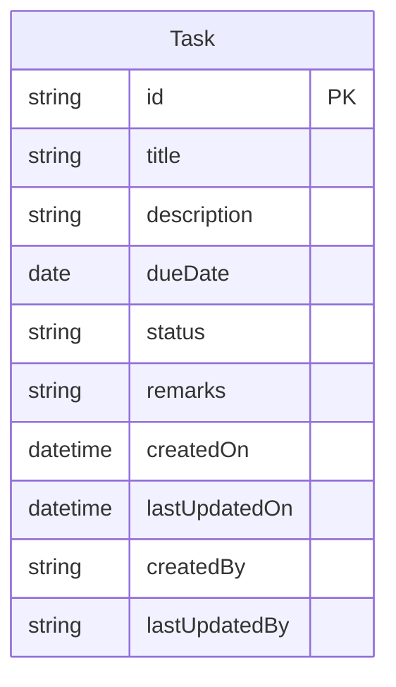

# Task Management Application

## 1. Overview
This is a Task Management application built using React.js that allows users to create, read, update, delete, and search tasks. The application follows the MVC (Model-View-Controller) pattern and implements a Single Page Application (SPA) architecture.

## 2. Database Design

### 2.1 ER Diagram


### 2.2 Data Dictionary
| Field | Type | Description |
|-------|------|-------------|
| id | string | Primary key, unique identifier for each task |
| title | string | Title of the task |
| description | string | Detailed description of the task |
| dueDate | date | Deadline for task completion |
| status | string | Current status (Pending/In Progress/Completed/Cancelled) |
| remarks | string | Additional notes or comments |
| createdOn | datetime | Timestamp of task creation |
| lastUpdatedOn | datetime | Timestamp of last update |
| createdBy | string | User who created the task |
| lastUpdatedBy | string | User who last updated the task |

### 2.3 Indexes
The application uses localStorage for data persistence, which automatically indexes the data by key. In a production environment with a proper database, we would recommend the following indexes:
- Primary Key Index on `id`
- Secondary Index on `status` for filtering tasks by status
- Secondary Index on `dueDate` for sorting and filtering by deadline

### 2.4 Code First vs DB First Approach
The application uses a Code First approach because:
1. It provides better control over the data model
2. Makes it easier to maintain and modify the schema
3. Allows for better version control of the data structure
4. Simplifies the development process in a JavaScript/React environment

## 3. Application Structure

### 3.1 Architecture
The application is built as a Single Page Application (SPA) using React.js. This choice was made because:
1. Provides a smoother user experience with no page reloads
2. Better performance through client-side rendering
3. Reduced server load
4. Easier state management
5. Better separation of concerns

### 3.2 MVC Implementation
The application follows the MVC pattern:
- **Model**: `Task.js` - Defines the data structure
- **View**: `TaskList.js` and `TaskForm.js` - Handles the UI components
- **Controller**: `TaskController.js` - Manages business logic and data operations

## 4. Frontend Structure

### 4.1 Technology Choice
The frontend is built using:
- React.js for the UI framework
- CSS for styling
- LocalStorage for data persistence

This choice was made because:
1. React provides efficient component-based architecture
2. Easy to maintain and scale
3. Large ecosystem of libraries and tools
4. Strong community support
5. Excellent performance for SPAs

## 5. Build and Installation

### 5.1 Environment Details
- Node.js (v14.0.0 or higher)
- npm (v6.0.0 or higher)

### 5.2 Dependencies
```json
{
  "dependencies": {
    "react": "^18.2.0",
    "react-dom": "^18.2.0",
    "react-scripts": "5.0.1"
  }
}
```

### 5.3 Build Instructions
1. Clone the repository:
```bash
git clone [repository-url]
```

2. Install dependencies:
```bash
npm install
```

3. Start the development server:
```bash
npm start
```

4. Build for production:
```bash
npm run build
```

### 5.4 Running the Application
1. After installation, the application will be available at `http://localhost:3000`
2. No additional setup is required as the application uses localStorage for data persistence

## 6. Additional Documentation

### 6.1 Features
- Create new tasks with detailed information
- View all tasks in a grid layout
- Edit existing tasks
- Delete tasks with confirmation
- Search tasks across all fields
- Responsive design for all screen sizes

### 6.2 Security Considerations
- Input validation on all forms
- XSS protection through React's built-in security features
- Data sanitization before storage

### 6.3 Future Improvements
- User authentication and authorization
- Real database integration
- Task categories and tags
- File attachments
- Email notifications
- Task sharing capabilities
